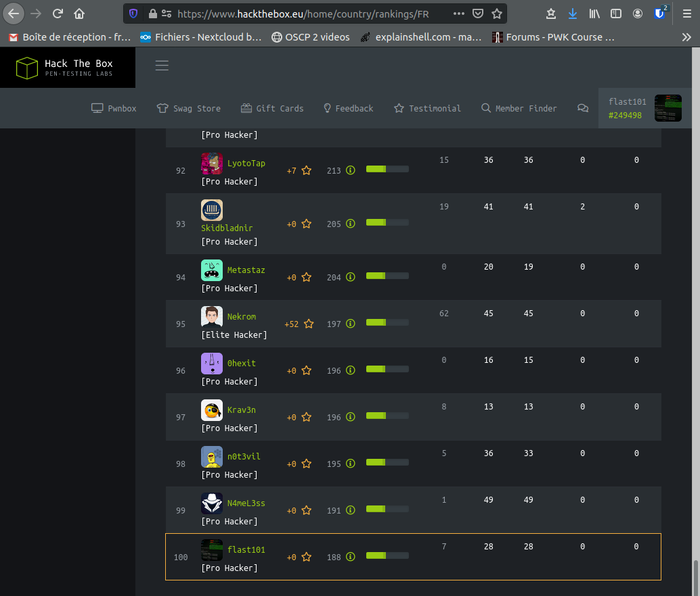

_[<-- Home](https://flast101.github.io)_

# $(whoami)
_Last update in August 2020_
* * * 

## Career

I am a cybersecurity engineer living near Marseille, France, and found of security and pentest. I am graduated from the ESIEE school in Paris in telecomuncations and networks, and lately I passed a "Master 2" in cybersecurity in AMU (Aix-Marseille University). I have been holding various positions in several industries including IT. I am currently employed by a software company as presales engineer in charge of security solutions. 

## OSCP Preparation

The [OSCP](https://www.offensive-security.com/pwk-oscp/) (Offensive Security Certified Professional) certification is an ethical hacking certification offered by [Offensive Security](https://www.offensive-security.com) that teaches penetration testing methodologies and the use of numerous tools. It is a hands-on penetration testing certification, requiring holders to successfully attack and penetrate various live machines in a safe lab environment. It is considered more technical than other ethical hacking certifications, and is one of the few certifications that requires evidence of practical penetration testing skills.   
The [OSCP](https://www.offensive-security.com/pwk-oscp/) (Offensive Security Certified Professional) certification is well-known, respected, and required for many top cybersecurity positions. Certified OSCPs are able to identify existing vulnerabilities and execute organized attacks in a controlled and focused manner.

I am  currently preparing this certification. The student is provided with a 850 pages book and video walk-through, and an access to a virtual penetration testing lab consisting of a total of 70 mahcines (50 can be accessed on the "public" network), in which students learn to conduct a penetration test from start to finish and practice techniques. It is a great course and a great learning experience.    
To earn the coveted OSCP certification, students must complete PWK and pass a proctored exam. The exam has a 24-hour time limit and consists of a hands-on penetration test in an isolated VPN network.

I am fairly new to pentest. I enrolled the PWK-OSCP course early february 2020 and subscribed for 3 months training period. I spent more than 500 hours learning pentest and improved a lot but I didn't attempt the exam yet. I will probably resub for a lab access before I attempt the exam (probably end 2020).

When working in the PWK lab, there is no writeup or walkthrough available and neither students nor OSCP certified are allowed to provide information about the lab solutions.    

Here are the 27 machines I rooted so far (August 2020) in the PWK Lab :    
_**Alice, Phoenix, Mike, Disco, Bob, Ralph, Pain, LeftTurn, Bethany, Alpha, BETA, Gamme, Bruce, Break, 1nsider, Tophat, Dotty, fc4, Susie, Kraken, Hotline, Joe, Core, Parrot, Humble, Sufferance, SVCLIENT08**_

## Online Cybersecurity Platforms Activity

I am also an active member of [TryHackMe](https://tryhackme.com) and [HackTheBox](https://www.hackthebox.eu), two well known online platforms for learning and practicing cyber security and pentesting. Links to my public profile on these sites are available in my signature below.

**HackTheBox machines I rooted so far (while active, writeups and walkthroughs are unavailbale):**    

| Rooted while retired | OS | Difficulty         | Rooted while active | OS | Difficulty|
|-------------|-------------|-------------|-------------|-------------|-------------| 
|Lame| Linux |Easy| Traverxec      |  Linux |Easy |
|Devel| Windows |Easy| Resolute|  Windows  |Medium |
|Beep| Linux |Easy| OpenAdmin |  Linux |Easy |
|Optimum| Linux |Easy|Monteverde| Windows |Medium|
|Arctic| Windows |Easy|Sauna| Windows |Easy|
|Grandpa| Windows |Easy|Book| Linux |Medium|
|Granny| Windows |Easy|Nest| Windows |Easy|
|Blocky| Linux |Easy|Remote| Windows |Easy|
|Sense| FreeBSD |Easy|Traceback| Linux |Easy|
|Nibbles| Linux |Easy|Cascade| Windows |Medium|
|Valentine| Linux |Easy|ServMon | Windows |Easy|
|Jerry| Windows |Easy|Magic| Linux |Medium|
|Netmon| Windows |Easy|Admirer| Linux |Easy|
|Jarvis| Linux |Medium |Cache| Linux |Medium|
|Forest| Windows |Medium|Blunder | Linux |Easy|
|Shocker| Linux |Easy| Buff | Linux | Easy |
|Blue| Windows |Easy|
|Legacy| Windows |Easy|
|Granny| Windows |Easy|
|Bashed| Linux | Easy |
| Mirai | Linux | Easy |
| Poison| FreeBSB | Medium |
| Bank | Linux | Easy |
| Cronos | Linux | Medium |
| PoCorn| Linux | Medium |
| SwagShop| Linux | Easy |
| SolidState| Linux | Medium |
| Sunday| Solaris| Easy |
| Haircut| Linux| Medium|
| Irked| Linux | Easy|
| DevOops| Linux| Medium |
| Postman| Linux| Easy|
| Active| Windows | Medium|
| Otober| Linux| Medium|
| Networked| Linux| Easy|
| Bastion| Windows | Easy |
| Bastard| Windows| Medium|
| Bounty| Windows | Easy |
| Hawk | Linux | Medium |

## Contact Information
$ ls -la .contact: [flast101.sec@gmail.com](mailto:flast101.sec@gmail.com)

   
QmUgQ3VyaW91cywgTGVhcm5pbmcgaXMgTGlmZSAhCg==

Be Curious, Learning is Life !

_[<-- Home](https://flast101.github.io)_

<!-- Global site tag (gtag.js) - Google Analytics -->

