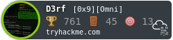

_[<-- Home](https://flast101.github.io)_

# $(whoami)
 
* * * 

## Career

I am a cybersecurity engineer living near Marseille, France, and found of security and pentest. I am graduated from the ESIEE school in Paris in telecomuncations and networks, and lately I passed a "Master 2" in cybersecurity in AMU (Aix-Marseille University). I have been holding various positions in several industries including IT. I am currently employed by a software company as presales engineer in charge of security solutions. 

## Contact Information
$ ls -la .contact: [flast101.sec@gmail.com](mailto:flast101.sec@gmail.com)

   
QmUgQ3VyaW91cywgTGVhcm5pbmcgaXMgTGlmZSAhCg==

Stay curious !

_[<-- Home](https://flast101.github.io)_

<!-- Global site tag (gtag.js) - Google Analytics -->

